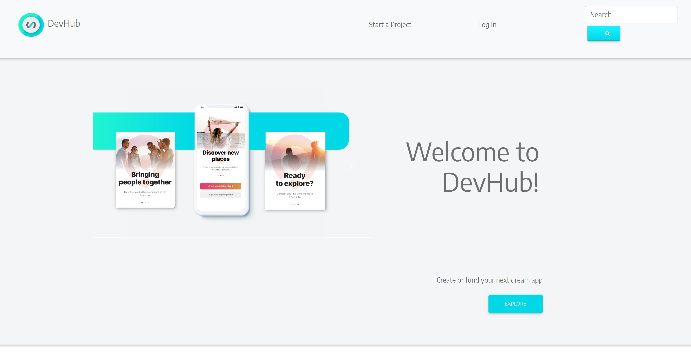
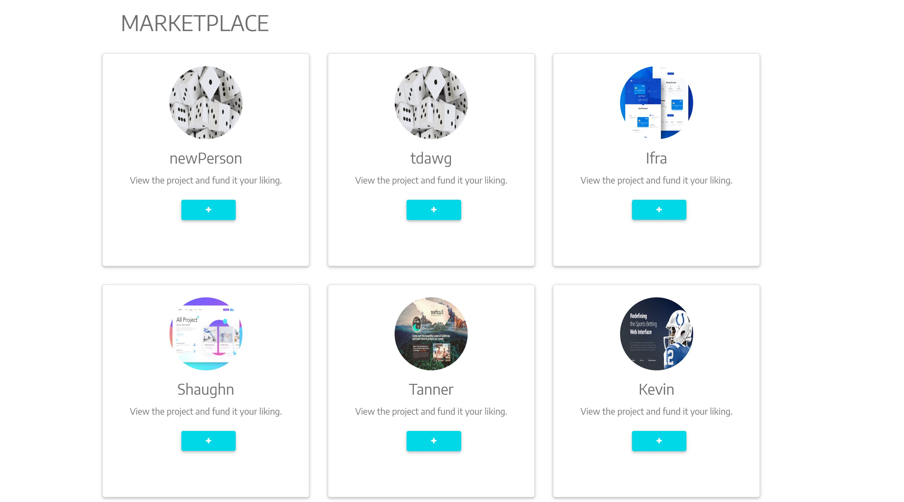
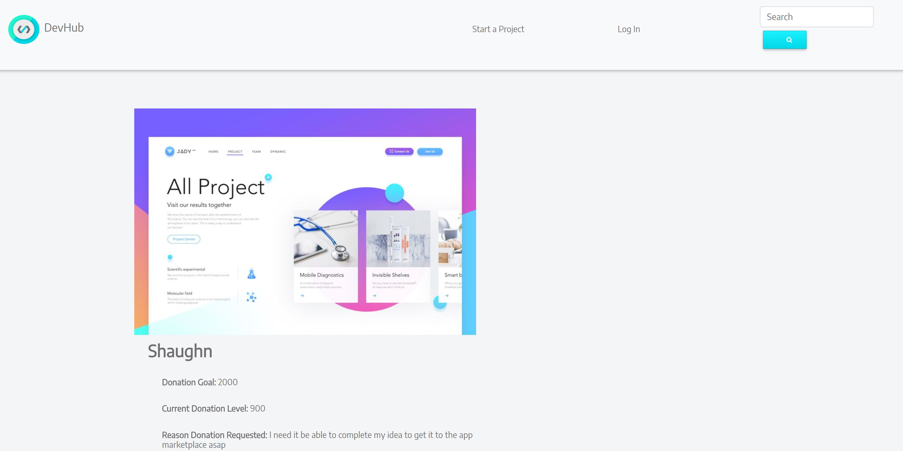
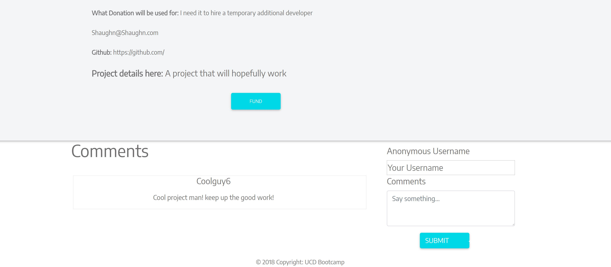
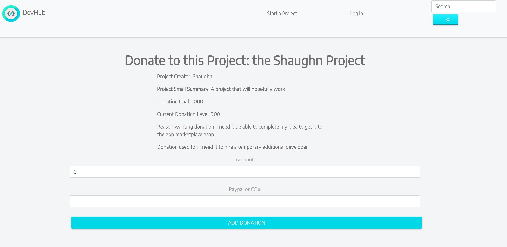
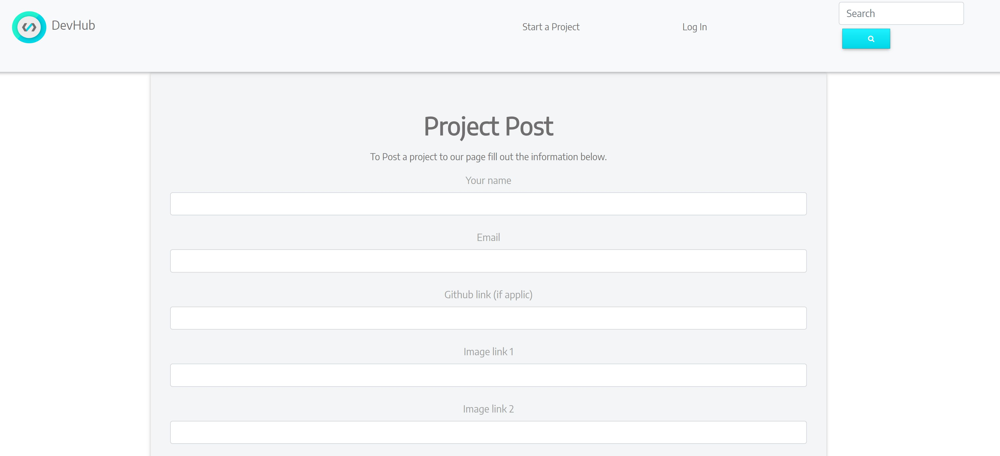
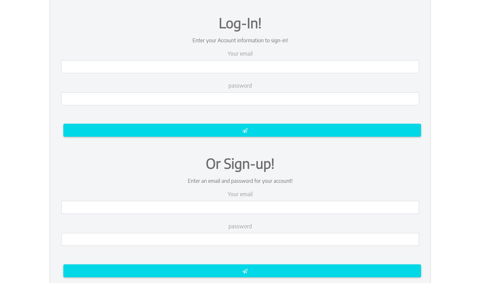

# Dev-Hub

link: https://gentle-ravine-72255.herokuapp.com/

## Description

Our application is mean to be a middleware for aspiring developers to test their ideas and apps out in the coding community to gage public interest and need before heading to the app store. 

Most apps fail very soon after launch in the App stores because of lack of interest, bad marketing campaigns, or just flat out because they were a bad idea from the start. With Dev-Hub, you will be able to bridge the gap and make an educated decisions on your app's progress or simply fund ideas that you and others find interesting. We allow members and non-members to donate to projects if they so desire. We at Dev-Hub believe this expands the coding community to those that not only know how to code, but to those everyday joe's that are interesting in funding the future.

## Motivation

We were struggling to pick an idea to go with in the begginning of this project, but decided on a hub for coders. We all love github, but what about a more expansive and visually appealing experience? We felt like, adding a donation option would expand the community of who would view our website and make it more appealing to a broader audience.

 
## Result

Using ES6, React, MDB-Bootstrap, CSS Animation, PixiJS, MongoDB, B-Crypt, Node, Mongoose, Express, Body Parser, and Heroku deployment(eventually) we were able to bring together this app. 

## Team Effort

Ifra and Shaughn worked on the user interface - from conception and planning, creating templates, design,and branding. Tanner made general page layouts, some front-end work, bridged the backend/frontend together via routing, transferred database data to the app, finsihed the API routing, created a working comment section for each project page, and created the functionality for donating. Kevin established our folder structure for our project, worked on API routing, created the database and dummy data, linked the database properly throughout our folder structure, logIn/signUp and other backend functionality.

## Challenges

The LogIn/SignUp functionality proved to be more difficult than originally thought. It is essentially half working. We would like to revist this eventually.

CSS react integration that createed issues with our backend happened a lot towards the end of the project, which confused the team. We were able to come up with a solution on the spot, but would also like to dive into this as well and figure out the reasoning for it. 

## Improvements

In the future we would like to have an image uploader instead of an image link when you create a project,paypal integration with the donation page (Right now we just have basically a dummy page with no exchange of CC info[that field is not required to donate] or paypal information), perhaps a sleeker formatting, a ratings system for people to rate other peoples projects, a views tally on each of the display cards, and actual filters: to filter thru users content (search bar, most viewed, highest rated, etc.). We would also like to have our LogIn working properly. 

